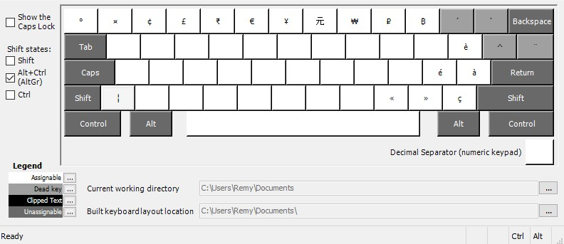
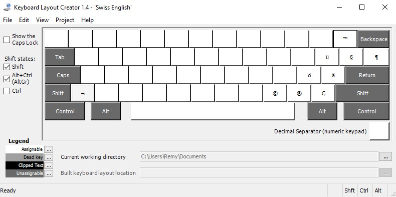

layout-ch_EN
============

A US keyboard layout expanded with Swiss diacritics for cosmopolitan Swiss coders who wants their keyboard to transcend national boundaries and erase digital frontiers.

Compile and install with [Microsoft Keyboard Layout Creator (MSKLC)](https://www.microsoft.com/en-us/download/details.aspx?id=22339).

## Layout

### US standard layout

Complete US layout:

### Swiss layout extension

Swiss layout diacritics with additional currency and other symbols:

